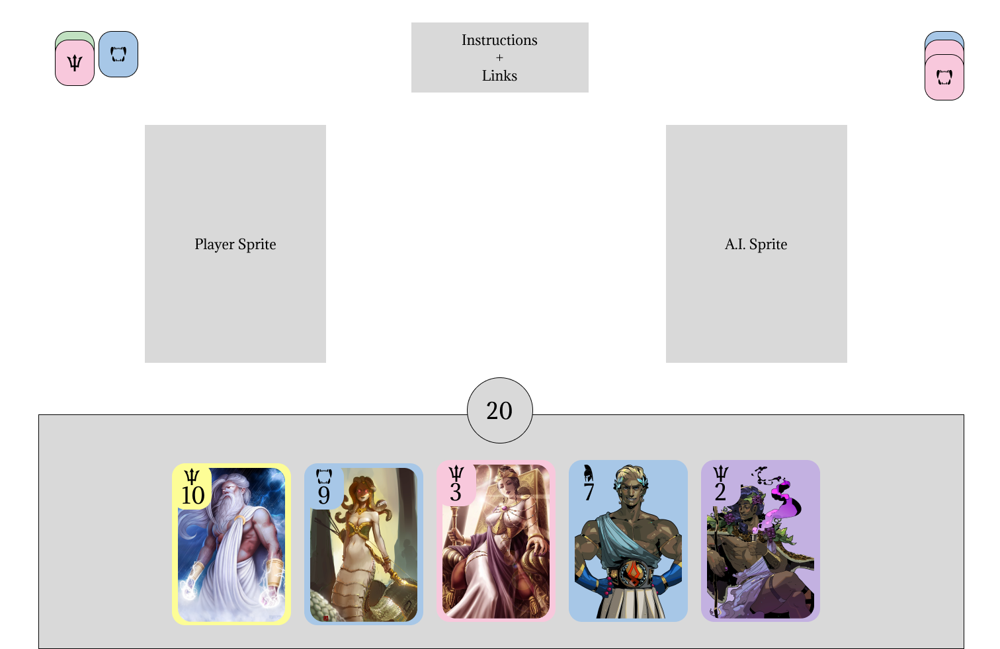

# Olympus Card-Jitsu

## Live Link
https://jzhou45.github.io/Olympus-Card-Jitsu/

## Background
### Club Penguin Card-Jitsu
Card-Jitsu is a mini-game that was first introduced in the formerly popular MMORPG, Club Penguin, in November of 2008, with the introduction of ninjas and the Dojo to servers. The card game follows a simple gameplay premise, where players would have decks with cards of three different types, that follow the classic Rock-Paper-Scissors structure, where 1 type would beat another, but lose to the other. The cards would also contain a number value and color associated with it for additional gameplay mechanics, along with cards with special effect that changes the rules of the round it's played in.

Each round of Card-Jitsu, would require each player to play 1 card at the same time. The player with the strong type would win the round, e.g. Water beats Fire in Card-Jitsu or Rock beats Scissors in Rock-Paper-Scissors. If both cards are of the same element, the card with the higher number value would win, otherwise the round will end in a tie.

After each round ends, the player would collect a token with the type and color of the card they won with. In order to win the game, a player would need to collect 3 tokens are different types or 3 tokens of the same type with different colors.

### Olympus Card-Jitsu
Olympus Card-Jitsu combines an agglomeration of favorite things from my childhood, including Club Penguin, ninjas (which inspired the original Card-Jitsu), and Greek myths and the Percy Jackson series.

Olympus Card-Jitsu aims to make a faithful adapatation to the core Card-Jitsu gameplay with new classes and cards based on Greek mythology and lore. In order to keep the game a client-side project, the opponenet will be a simple A.I., rather than an opposing player.

## Wireframe

The wireframe above displays the framework of the core game screen where:
  * Users are able to view their hand and remaining time on the bottom of the screen.
  * When time runs or when user and A.I. has chosen their cards, they will both display on the board, represented by user sprites in the above wireframe.
  * The top left represents all the cards the user has won with in the form of tokens or sprites, whereas the top right represents the A.I.'s.
  * The top center section contains buttons to open a modal of information along with sound settings.

## Functionality & MVPs
In Olympus Card-Jitsu, users will be able to:
  * Interact with different aspects and element on the page for animations.
  * Start games with a shuffled deck.
  * Hover over cards for more information.
  * Play cards onto the board.
  * Have cards be played for them, if timer runs out or player is away from keyboard.
  * Restart game.

In addition, this project includes:
  * Instructions and in-game modals for instructions if player forgets.
  * Music and sound effects.
  

## Technologies, Libraries, APIs
This project will is implemented with the following technologies:
  * Game functions and user interactions are handled with Vanilla JavaScript through DOM Manipulation.
  * npm for mangaging project dependencies.
  * Webpack and babel to bundle and transpile the source JavaScript Code.

## Implementation Timeline
  * Friday Afternoon & Weekend: Built card, hand, and deck classes and objects along with corresponding DOMs for user interactivity.
  * Monday: Implemented game logic for winning rounds, along with quality of life improvements to cards.
  * Tuesday: Built A.I. and corresponding classes and game logic.
  * Wednesday: Allowed for multiple rounds to be played and implemented game win logics.
  * Thursday Morning: Deploy onto GitHub Pages along with polishing user interface and experience.